# 📊 System Architecture & Flow Diagrams

High-level visual representations of the ERC-4337 Account Abstraction system architecture and key flows.

---

## 🏗️ Overall System Architecture

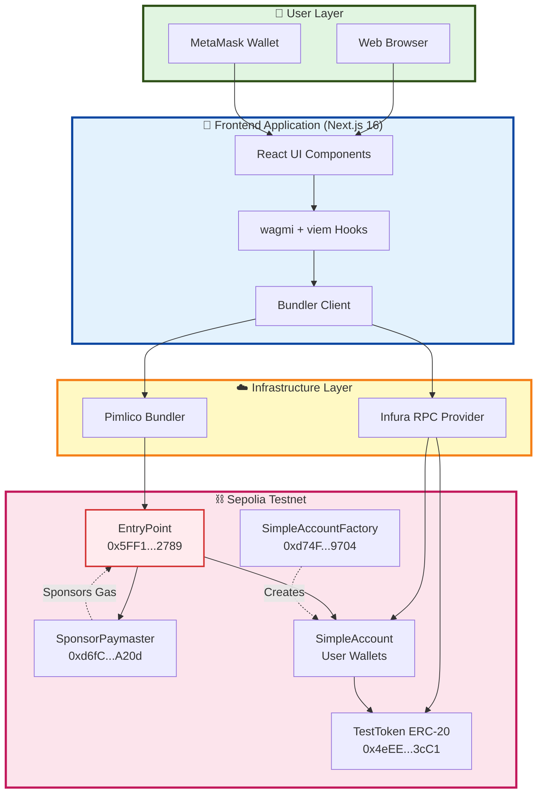

---

## 🔄 High-Level Transaction Flow

```mermaid
flowchart LR
    A[👤 User<br/>Initiates Transfer] --> B[🎨 Frontend<br/>Creates UserOp]
    B --> C[☁️ Bundler<br/>Validates & Submits]
    C --> D[⛓️ EntryPoint<br/>On-Chain Validation]
    D --> E[💰 Paymaster<br/>Sponsors Gas]
    E --> F[🔐 Account<br/>Executes Transfer]
    F --> G[🪙 Token<br/>Updates Balances]
    G --> H[✅ Success<br/>TX Confirmed]
    
    style A fill:#e1f5e1,stroke:#2d5016,stroke-width:2px
    style B fill:#e3f2fd,stroke:#0d47a1,stroke-width:2px
    style C fill:#fff9c4,stroke:#f57f17,stroke-width:2px
    style D fill:#fce4ec,stroke:#c2185b,stroke-width:2px
    style E fill:#f3e5f5,stroke:#7b1fa2,stroke-width:2px
    style F fill:#e0f2f1,stroke:#00695c,stroke-width:2px
    style G fill:#fff3e0,stroke:#ef6c00,stroke-width:2px
    style H fill:#e8f5e9,stroke:#2e7d32,stroke-width:2px
```

---

## 📦 Component Architecture

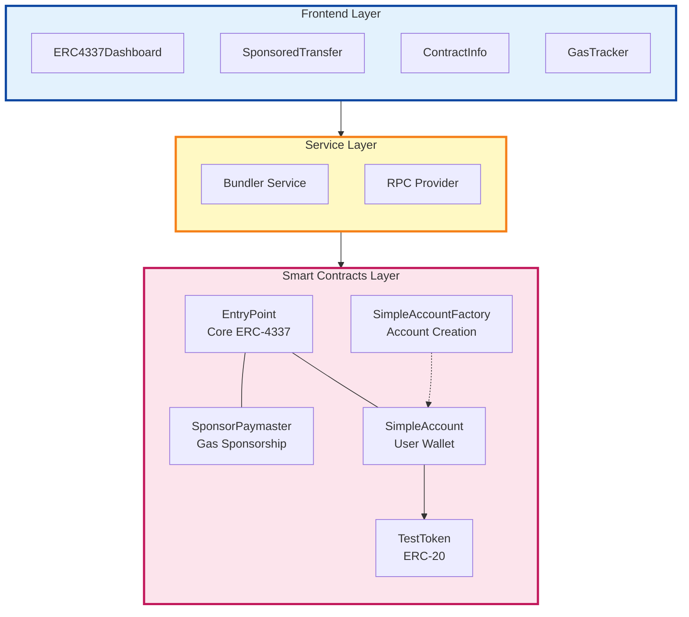

---

## 🎯 Key Interactions

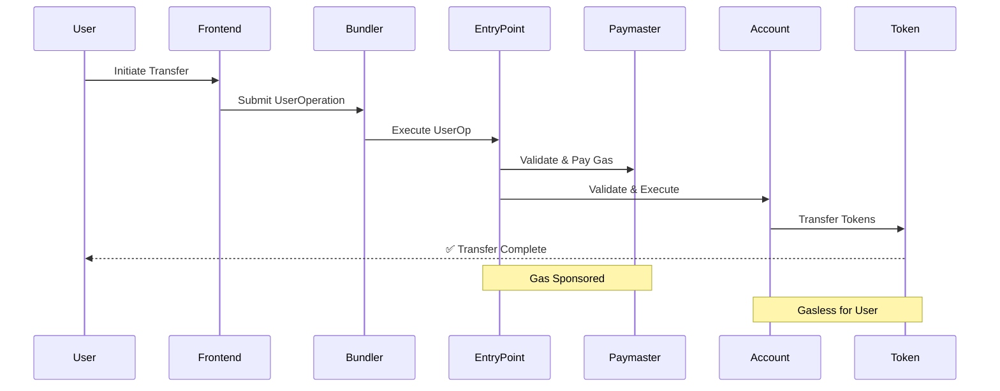

---

## 🔐 Account Abstraction Stack

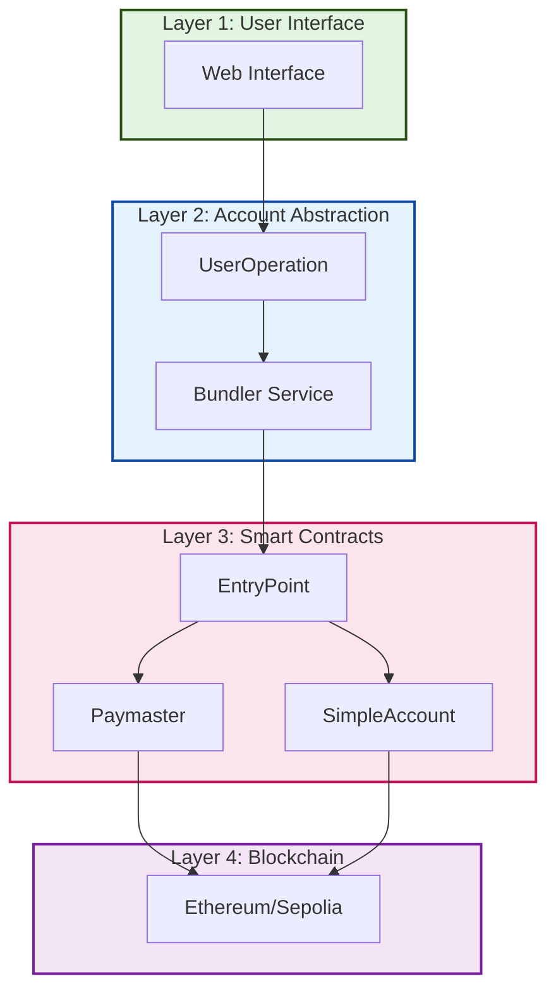

---

## 💸 Gas Sponsorship Model

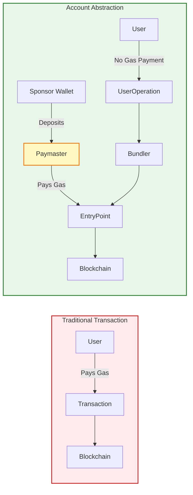

---

## 🔄 Data Flow

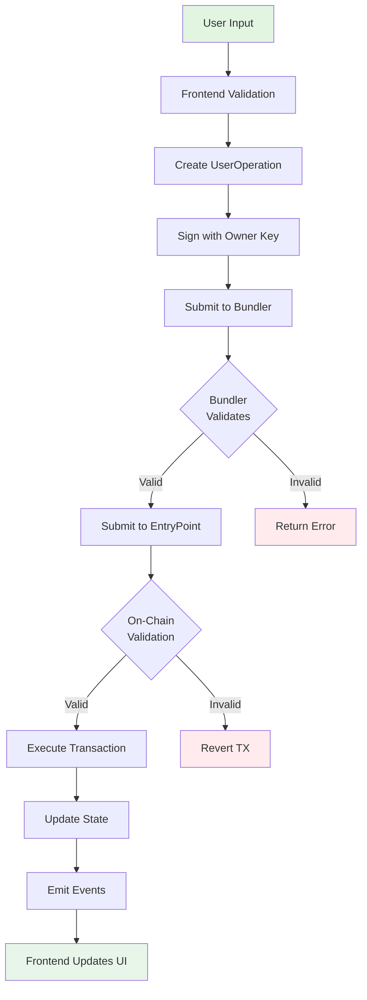

---

## 🏭 Contract Deployment Structure

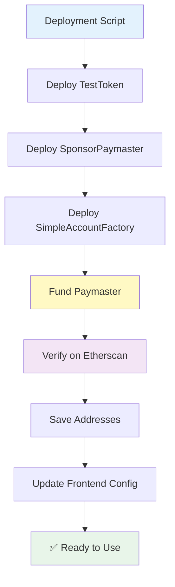

---

## 🎨 Frontend Architecture

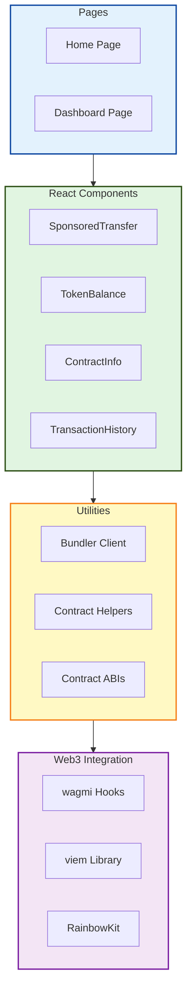

---

## 🔗 Technology Stack Layers

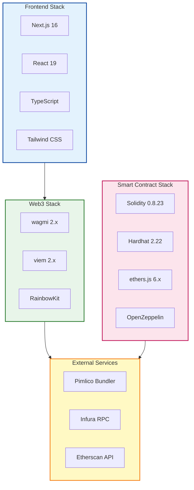

---

## 🧪 Testing Structure

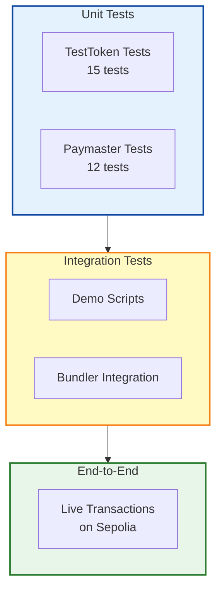

---

## 📁 Project Structure Overview

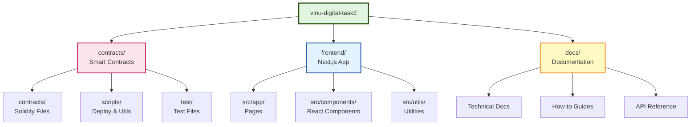

---

## 🚀 Deployment Pipeline

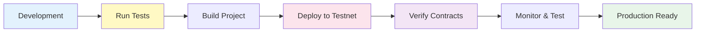

---

## 🎯 User Journey Overview

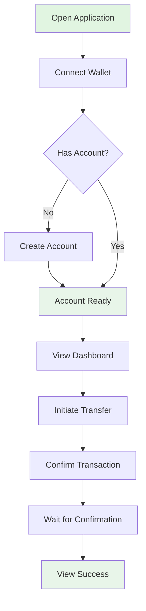

---

## 📊 How to Use These Diagrams

### GitHub/GitLab
These Mermaid diagrams render automatically on GitHub and GitLab. Just view this file in your repository.

### Export as Images
1. Visit [Mermaid Live Editor](https://mermaid.live/)
2. Copy any diagram code
3. Export as PNG, SVG, or PDF

### In Presentations
- Use screenshots for quick presentations
- Export as SVG for scalable graphics
- Use Mermaid plugins for tools like VS Code, Obsidian

### Reference in Code
```typescript
/**
 * Transaction flow implementation
 * See: docs/FLOWCHARTS.md - "High-Level Transaction Flow"
 */
function sendTransaction() {
  // implementation
}
```

---

## 🔄 Updating Diagrams

When updating the system:
1. Identify affected diagrams
2. Update Mermaid code
3. Test rendering on GitHub
4. Update references in documentation

---

## 📚 Diagram Legend

### Colors
- 🟢 **Green** - User interactions, success states
- 🔵 **Blue** - Frontend components, UI layer
- 🟡 **Yellow** - Infrastructure, services
- 🔴 **Pink/Red** - Blockchain, smart contracts
- 🟣 **Purple** - Special components (Paymaster, etc.)

### Arrows
- **Solid →** - Direct calls/interactions
- **Dashed -.->** - Creates, supports, sponsors
- **Bold ⟹** - Main flow path

---

**Last Updated:** December 2, 2025  
**Total Diagrams:** 14 high-level architecture views  
**Format:** Mermaid.js  
**Purpose:** System overview and architecture understanding
